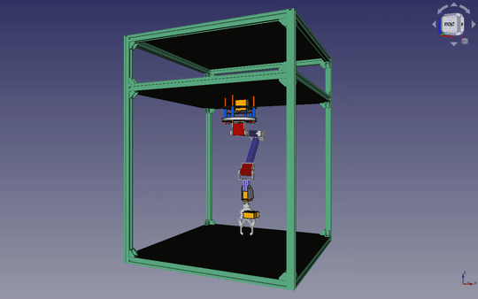

### Hi, I'm Kamil and welcome to my repository.

I'm currently working on my robot 🤖 (and other projects listed below) and looking for Software Engineering job opportunities.
Ideally, in robotics or related to, like computer vision. I'm also interested in robotics hardware positions.

||
|
|

### code:
* :white_circle: :black_circle: [Reversi in JavaFx](https://github.com/yacotaco/Reversi) 
* :construction: :white_circle: :robot: [Reversi 3D in JavaScript with AI](https://github.com/yacotaco/reversi-web) :arrow_right: [PLAY](https://yacotaco.github.io/reversi-web/)
* 🐍 [Snake in Pygame](https://github.com/yacotaco/snake)
* :construction: :robot: [MR.COFFEE - connected chess-playing robot](https://github.com/yacotaco/mrcoffee.git) :arrow_right: [project site](https://yacotaco.github.io/mrcoffee/)
* :construction: :scroll: [Deep Learning papers implementation](https://github.com/yacotaco/papers_and_code)

<!-- * :construction: ♙ [Chessboard state recognition for OTB chess](https://github.com/yacotaco/ChessView) :arrow_right: [project site](https://yacotaco.github.io/chess-view/) -->
